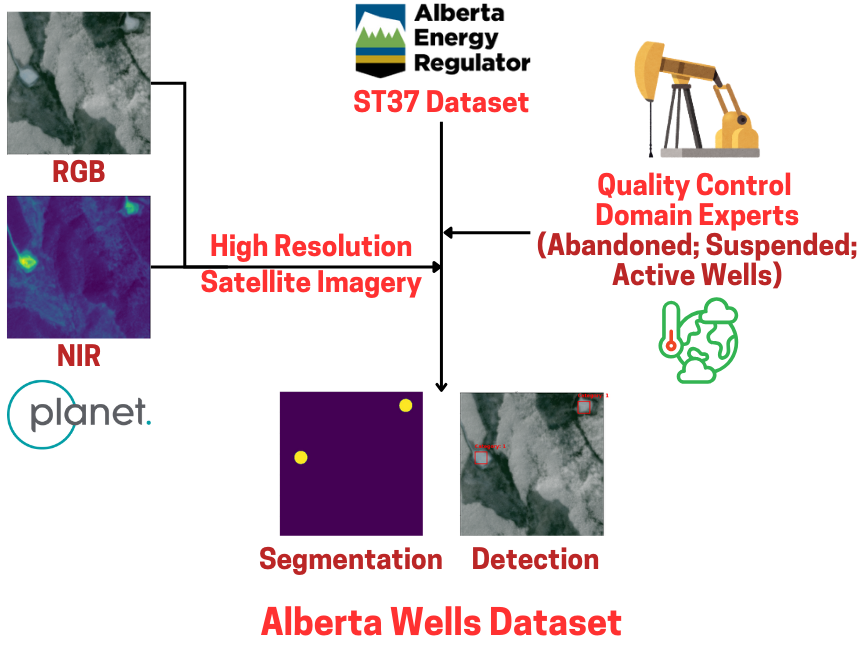

<div align="center">
  
# [Alberta Wells Dataset: Pinpointing Oil and Gas Wells from Satellite Imagery](https://arxiv.org/abs/2410.09032)

[](https://arxiv.org/abs/2410.09032)
[](https://zenodo.org/records/13743323)



Pratinav Seth (#), Michelle Lin (#), Brefo Dwamena Yaw, Jade Boutot, Mary Kang & David Rolnick.

(# -Denotes co-first authorship.)

</div>

      
## Dataset Access
The dataset is publicly available for academic research. You can access it directly from Zenodo: [Alberta Wells Dataset on Zenodo](https://zenodo.org/records/13743323). Given the large size, if you want to install using zenodo downloader then : 

```python
pip install zenodo_get
zenodo_get 13743323
```
(NOTE : If you want to run with the code in this repository dont download at this point follow instructions in next section)

## Setup Project
### Clone the Github Repo
```
git clone https://github.com/RolnickLab/Alberta_Wells_Dataset.git
cd Alberta_Wells_Dataset
export AWD_CODEBASE=$(pwd)
```
### Download the Dataset

#### Create a setup conda enviroment
```
conda create --name awd_setup python=3.10
conda activate awd_setup
```

#### Download from Zenodo (HDF5 File)
```
cd $AWD_CODEBASE
mkdir downloads
cd downloads
pip install zenodo_get
zenodo_get 13743323
cat train_set.tar.gz.part_* > train_set.tar.gz
tar -xzvf eval_set.tar.gz
tar -xzvf test_set.tar.gz
tar -xzvf train_set.tar.gz
cd ..
```

#### Split HDF5 File into Single Instances for Faster Processing
```
python setup/file_handling_cc_train.py $PWD
python setup/file_handling_cc_test.py $PWD
python setup/file_handling_cc_eval.py $PWD
```


### Running Experiments

#### Setup Experimets Conda Enviroment

```python
cd $AWD_CODEBASE
conda create --name awd python=3.11.7
conda activate awd
cd setup
pip install -r requirements.txt
cd ..
```

#### Training

```python
TORCH_USE_CUDA_DSA=1 python main.py --config=configs/<directory_location>/<filename>.json --CUR_DIR=$AWD_CODEBASE --SEED=333
```
To continue training from a checkpoint, make the following change in the config.json file : 

```
    "checkpoint_file": "False",
```

to

```
    "checkpoint_file": <relative location of checkpoint in codebase>",
```

#### Inference

To run inference using a specific checkpoint after training, or to continue training from a checkpoint, make the following change in the config.json file : 

```
  "max_epoch": 50,
  "checkpoint_file": "False",
  "data_mode": "training",
```

to

```
  "max_epoch": -1,
  "checkpoint_file": <relative location of checkpoint in codebase>",
  "data_mode": "inference_valid_test",
```

## Contributions
If you find the dataset valuable for your research, please cite our work using the following reference:


```bibtex
@misc{seth2024albertawellsdatasetpinpointing,
      title={Alberta Wells Dataset: Pinpointing Oil and Gas Wells from Satellite Imagery},
      author={Pratinav Seth and Michelle Lin and Brefo Dwamena Yaw and Jade Boutot and Mary Kang and David Rolnick},
      year={2024},
      eprint={2410.09032},
      archivePrefix={arXiv},
      primaryClass={cs.CV},
      url={https://arxiv.org/abs/2410.09032},
}
```